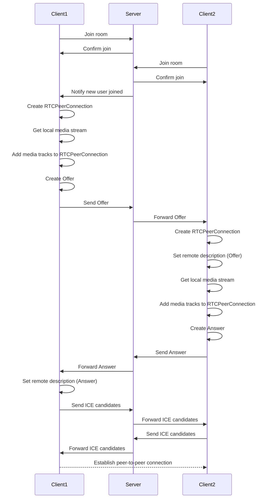
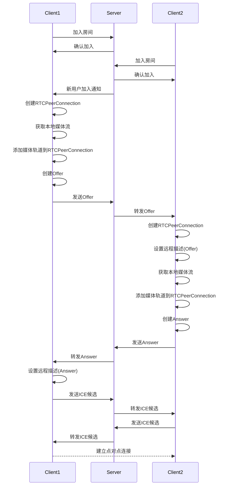

# Minimal WebRTC Implementation / WebRTC视频通信最小实现

<details>
<summary>English</summary>

This project is a minimal implementation of WebRTC video communication based on Socket.IO, WebRTC, and Next.js.

## Features

- Real-time video calling
- Room-based communication
- Peer-to-peer connections using WebRTC
- Signaling via Socket.IO

## Tech Stack

- Next.js
- Socket.IO
- WebRTC API

## Quick Start

1. Install dependencies:

```bash
npm install
```

2. Run the development server:

```bash
npm run dev
```

3. Open `http://localhost:3000` in your browser

## Core Processes

The WebRTC communication process primarily consists of the following stages:

1. Joining a room
2. Media negotiation
3. ICE candidate exchange
4. Establishing peer-to-peer connection

### Sequence Diagram



## Contributing

Issues and pull requests are welcome.

## License

[MIT](https://choosealicense.com/licenses/mit/)

</details>

<details>
<summary>中文</summary>

这个项目是基于Socket.IO、WebRTC和Next.js的WebRTC视频通信最小实现。

## 功能特点

- 实时视频通话
- 基于房间的通信
- 使用WebRTC进行点对点连接
- 使用Socket.IO进行信令

## 技术栈

- Next.js
- Socket.IO
- WebRTC API

## 快速开始

1. 安装依赖:

```bash
npm install
```

2. 运行开发服务器:

```bash
npm run dev
```

3. 在浏览器中打开 `http://localhost:3000`

## 核心过程

WebRTC通信过程主要包括以下几个阶段:

1. 进入房间
2. 媒体协商
3. ICE候选交换
4. 建立点对点连接

### 时序图



## 贡献

欢迎提交问题和拉取请求。

## 许可证

[MIT](https://choosealicense.com/licenses/mit/)

</details>

